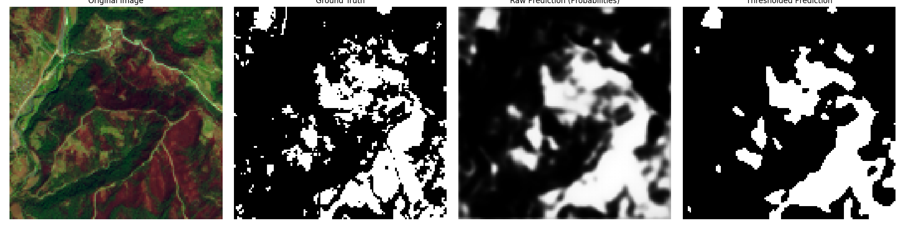
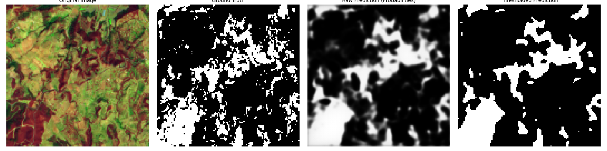
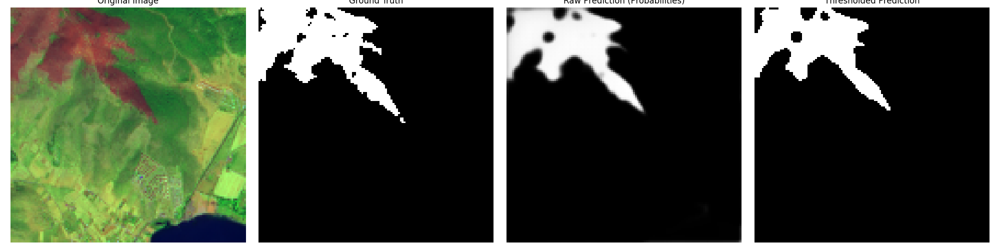

# Satellite Image Segmentation for Wildfire Detection

This project implements a U-Net based deep learning model for segmenting wildfire areas in satellite imagery. The model is trained to identify and delineate wildfire-affected regions from satellite images.

## Project Structure

- `model_training.py`: Contains the U-Net model architecture and training pipeline
- `model_evaluation.py`: Implements model evaluation and visualization
- `dataset_analysis.py`: Tools for analyzing and preprocessing the dataset
- `data/`: Directory containing training images and masks
- `evaluation_results/`: Contains model predictions and evaluation metrics

## Model Performance

The model achieves the following metrics on the test set:
- Precision: 0.8796
- Recall: 0.7178
- F1 Score: 0.7905
- IoU Score: 0.6536

### Sample Predictions

Below are some example predictions from the model:

## Dataset

The model is trained on the [Turkey's Wildfire 2021 Multispectral Sentinel-2 Satellite Imagery](https://data.mendeley.com/datasets/hgctmx9y6c/1) dataset, which contains 25,563 images of 128x128 pixels with three multispectral bands. Each image is paired with a binary mask where burned areas are labeled as 1 and non-burned areas as 0, providing a comprehensive dataset for wildfire segmentation tasks.